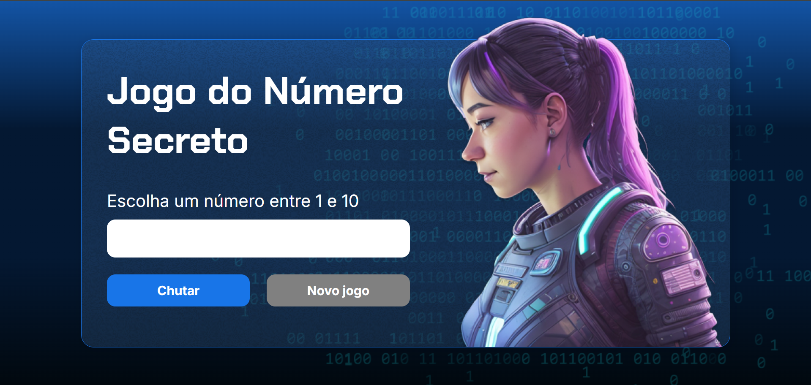

# 🎮 Jogo do Número Secreto

## Descrição

Bem-vindo ao **Jogo do Número Secreto**!  
Este é um jogo onde o usuário tenta advinhar um número entre 1 e 10 desenvolvido usando html, css e javascript.  
Desafie-se e se divirta com a família e amigos!

Este jogo foi desenvolvido como parte dos estudos na plataforma Alura, durante o curso de **Lógica de Programação**.
A Alura oferece uma ampla gama de cursos focados em desenvolvimento, design, marketing e muito mais, e foi fundamental para a construção desse projeto, que tem como objetivo aplicar conceitos práticos de **Javascript**.

## Como jogar

1. Use o campo em branco para inserir o número que você suspeita que seja o secreto.
2. Clique em **chutar** para concluir sua tentativa de acerto.
3. Caso você acerte, o jogo irá exibir uma mensagem na tela lhe parabenizando.
4. Clique em **novo jogo** para iniciar uma nova rodada com um número secreto diferente.

## Teste o jogo agora!

Você pode testar a versão do jogo diretamente no seu navegador:

[**Clique aqui para jogar!**](https://jogo-numero-secreto-pi-woad.vercel.app/)

## Contribuições

Contribuições são bem-vindas!  
Se você quiser reportar um bug, sugerir uma funcionalidade ou enviar um PR, fique à vontade.
